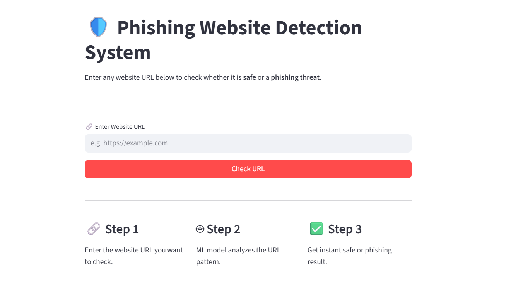

# 🛡️ Phishing Website Detection System

A machine learning web app that detects whether a URL is a **phishing** website or a **safe** website — instantly.

---

## 📸 Screenshot



---

## 🧠 How It Works

1. Enter a website URL
2. ML model (Logistic Regression) analyzes the URL pattern
3. Get instant result — Safe ✅ or Phishing ⚠️

---

## 🛠️ Tech Stack

- **Python** — Streamlit, Scikit-learn
- **Model** — Logistic Regression (~97% accuracy)
- **Dataset** — 500,000+ labeled URLs

---

## ⚙️ Run Locally

```bash
git clone https://github.com/AyeshaAndleeb/Phising-website-detection-system-ml.git
cd Phising-website-detection-system-ml
pip install -r requirements.txt
streamlit run app.py
```

---

## 🧪 Test Examples

| URL | Result |
|-----|--------|
| `https://google.com` | ✅ Safe |
| `http://paypal-secure-login.xyz` | ⚠️ Phishing |

---

👩‍💻 **Author:** [Ayesha Andleeb](https://github.com/AyeshaAndleeb)  
⭐ Star this repo if you found it helpful!
